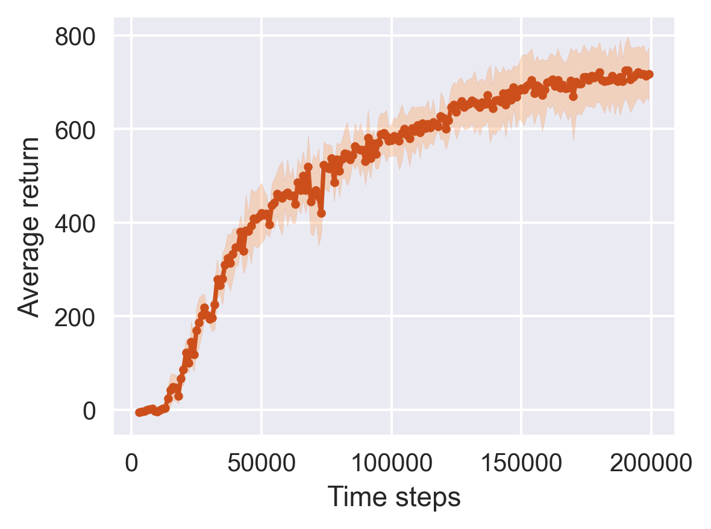
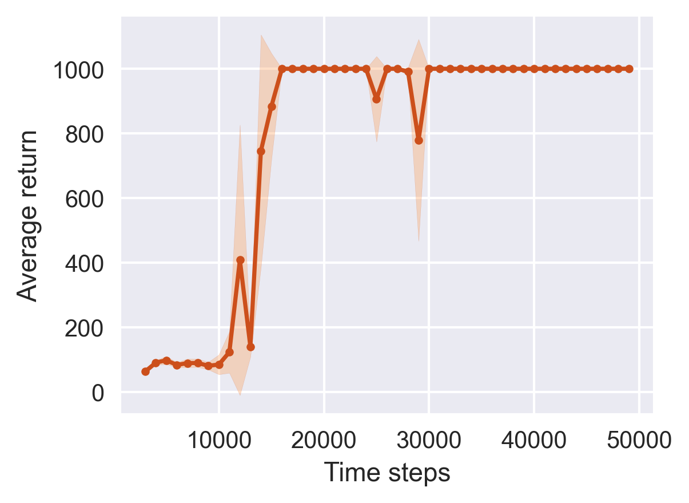
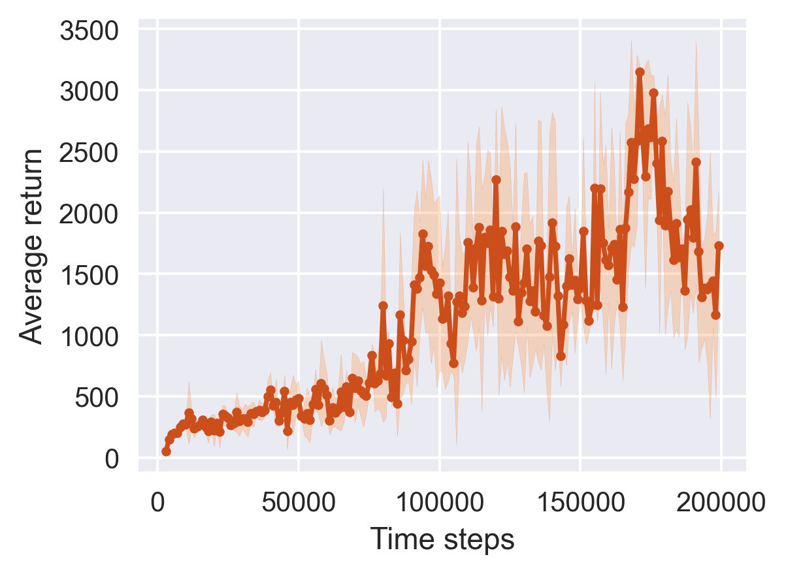
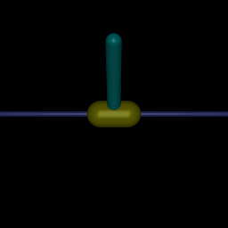
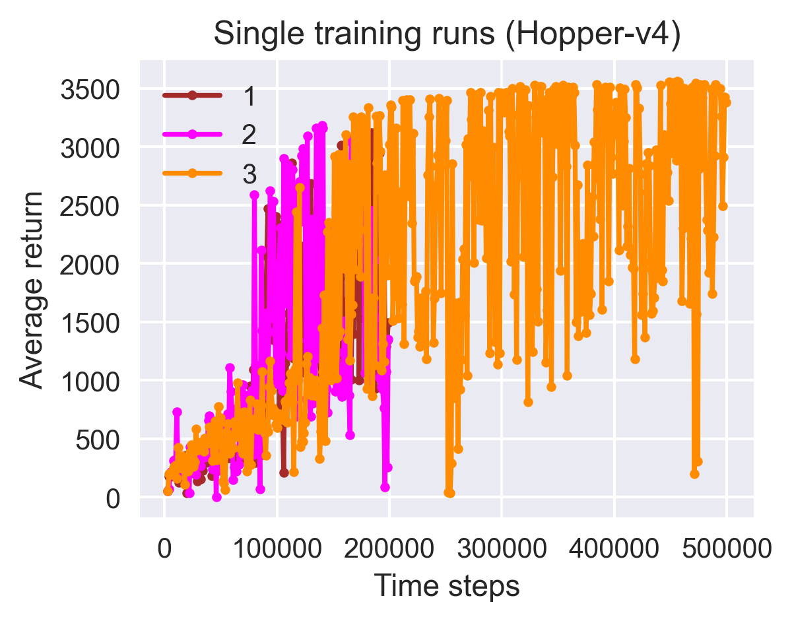

# Blog post: *Soft Actor-Critic*

<table>
  <tr>
    <td><p align="center">HalfCheetah-v4</p></td>
    <td><p align="center">InvertedPendulum-v4</p></td>
    <td><p align="center">Hopper-v4</p></td>
  </tr>
  <tr>
    <td></td>
    <td></td>
    <td></td>        
  </tr>
  <tr>
    <td></td>
    <td></td>
    <td></td>
  </tr>
</table>


Here, we provide supplementary material accompanying the blog post [*Soft Actor-Critic*](https://chrishoffmann.dev/post/soft_actor_critic), which was published on my personal website (https://chrishoffmann.dev). 

Namely, we supply:
- __code for training agents__ in Gym environments using the soft Actor-Critic algorithm implemented with PyTorch as the engine for automatic differentiation
- __logs of training runs__ performed in 3 different environments as well as the parameters of the learned policies
- __code for analyzing training__ that generates learning curves and gif files, which are also shown at the top of this README and included in the `assets` directory
- a __Jupyter notebook for__ performing training and evaluation on __Google Colab__


## Requirements
We recommend using conda for managing dependencies. To install the required packages followed by activating the created conda environment, run these two commands:

```
conda env create -f dependencies/environment.yml
conda activate sac
```

## Training
To launch 3 independent training runs—with different random seeds—in the Gym environment [*HalfCheetah-v4*](https://www.gymlibrary.dev/environments/mujoco/half_cheetah/), run this script:

```
bash scripts/run_half_cheetah.sh
```

Note that the [`scripts`](scripts) directory also contains code for training in two other Gym environments, namely  [*InvertedPendulum-v4*](https://mgoulao.github.io/gym-docs/environments/mujoco/inverted_pendulum/) and [*Hopper-v4*](https://www.gymlibrary.dev/environments/mujoco/hopper/). Launching training jobs in these environments works as before:
```
bash scripts/run_<env-name>.sh
```
The placeholder `<env-name>` either refers to `inv_pendulum` or `hopper`.

The directory [`Experiments`](Experiments), whose structure is shown below, contains the training logs in the form of TensorBoard events files (`events.out.tfevents.*`) and the parameters of the trained Actors (`policy_ckpt.pth`). 

```
Experiments/
├── HalfCheetah-v4__seed_1
│   ├── events.out.tfevents.1684877829.LAPTOP-H9864UL1.3436.0
│   └── policy_ckpt.pth
├── HalfCheetah-v4__seed_2
│   ├── events.out.tfevents.1684949961.LAPTOP-H9864UL1.12200.0
│   └── policy_ckpt.pth
├── HalfCheetah-v4__seed_3
│   ├── events.out.tfevents.1684998319.LAPTOP-H9864UL1.2896.0
│   └── policy_ckpt.pth
├── Hopper-v4__seed_1
│   ├── events.out.tfevents.1685109663.LAPTOP-H9864UL1.7552.0
│   └── policy_ckpt.pth
├── Hopper-v4__seed_2
│   ├── events.out.tfevents.1685136286.LAPTOP-H9864UL1.8400.0
│   └── policy_ckpt.pth
├── Hopper-v4__seed_3
│   ├── events.out.tfevents.1685237842.LAPTOP-H9864UL1.7248.0
│   └── policy_ckpt.pth
├── InvertedPendulum-v4__seed_1
│   ├── events.out.tfevents.1685043222.LAPTOP-H9864UL1.464.0
│   └── policy_ckpt.pth
├── InvertedPendulum-v4__seed_2
│   ├── events.out.tfevents.1685046647.LAPTOP-H9864UL1.4536.0
│   └── policy_ckpt.pth
└── InvertedPendulum-v4__seed_3
    ├── events.out.tfevents.1685049974.LAPTOP-H9864UL1.12808.0
    └── policy_ckpt.pth
```

To showcase the information gathered in the event files (except the video sequences) including the complete set of applied hyperparameters, we share the TensorBoard for training in the HalfCheetah environment via the following link:
https://tensorboard.dev/experiment/arrPf48mRMqv8VJKfnioXg/#scalars

## Evaluation
To analyze training, we read from the event files to generate plots and harness the learned policy—represented by the Actor network—to visualize how well trained agents perform.

To evaluate the training, run:
```
python analyze_runs.py --out-dir <dir_path>
```
This generates the plots and gif files shown at the top of this README. The plot panel (upper row) shows learning curves in which we average the results from the independent runs, and also display the 68% confidence interval. The video sequences (lower row) illustrate the quality of the learned policy. 


## Train and Evaluate on Colab
Alternatively, we provide the option to do training and evaluation on Google Colab. 
If you are interested, just click the bottom below to open the relevant notebook:
<p>
<a target="_blank" href="https://colab.research.google.com/github/chris-hoffmann/post2_soft_actor_critic/blob/main/sac_colab.ipynb">

</p> 


## Additional Insights
<p align="center">
  
&nbsp; &nbsp; &nbsp; &nbsp;
  
  <p><i>Figure 1.</i> Investigation of the performance in the <i>Hooper-v4</i> environment upon training for more time steps (left) or increasing the learning rate of the Critic (right).</p>
</p>

Compared with the other two environments, the learning curve for the *Hopper-v4* environment looks rather wiggly and includes shorter periods where the overall performance is decreasing. To check the stability of the learning, we perform a single training run that involves 500k steps instead of 200k. The left panel of Figure 1 shows the individual learning curves obtained for *Hopper-v4* including the longer run shown in orange, which corresponds to a random seed value of 3. We see that the return trends to improve beyond 200k steps while the observed fluctuations remain present.

Inspired by other available implementations, e.g., in [Stable Baselines3]("https://github.com/DLR-RM/stable-baselines3"), we perform a test run to examine whether increasing the learning rate of the Critic network can indeed boost performance. The right panel of Figure 1 shows a comparison of two runs in *Hopper-v4* that use distinct learning rates. Visually, it seems that increasing this learning rate from $\text{3e-04}$ to $\text{1e-03}$—while all other parameters including the learning rate of the Actor remain unchanged—results in faster learning even though the final performance, after 200k steps, shows only a modest improvement.

## Acknowledgement
The implementation of the Actor network is inspired by [CleanRL](https://docs.cleanrl.dev/). Also, two educational resources were helpful for organizing the code: (1) [*Spinning Up in Deep RL*](https://spinningup.openai.com/en/latest/), and (2) [*Homework 3 of CS285*](https://github.com/berkeleydeeprlcourse/homework_fall2022/tree/main/hw3) taught at UC Berkeley. Thanks to all authors, contributors, and teachers for making such excellent sources of knowledge available to a wide audience.
